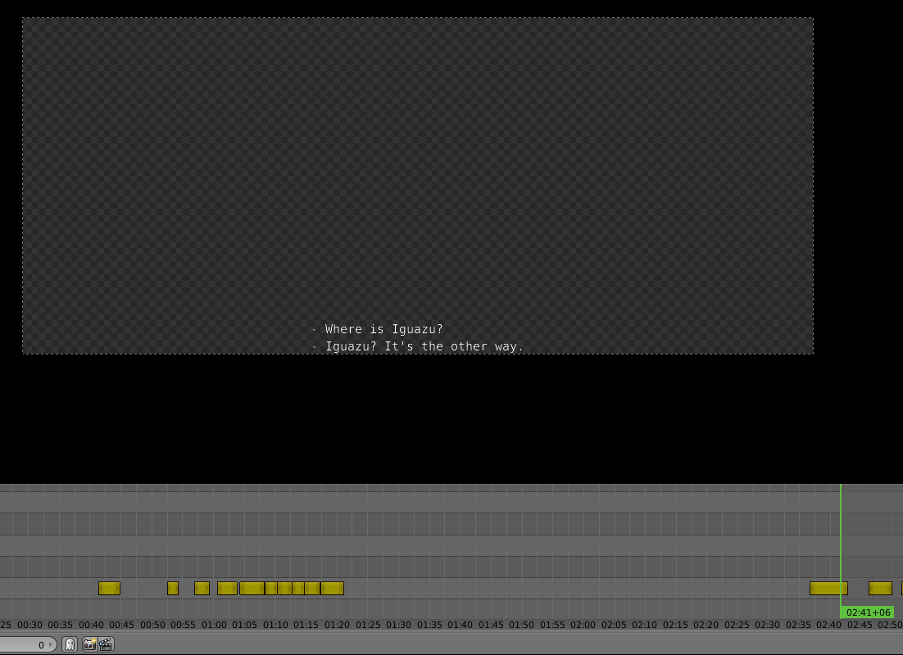

Load .srt Subtitles into Blender's VSE
========================================
:Version: v0.0.2
:Author: gabriel@tibas.london

Load subtitles into blender's VSE.
Uses `pysrt` under the hood.

Installation
------------

Download the zip from the releases_ page, and unpack it in your ``script/addons/`` folder_.
Restart Blender, open your preferences panel, and on addons search and activate `Load subtitles to VSE`.
Click the `Save user settings` button to persist the addon.

Usage
-----

To run the addon, go to the `Video Sequence Editor` context, press `space` to bring up the search operator input.
Type ``Import subtitle file`` ... to find the operator, and call it.
Find your ``.srt`` file and load it.

**NOTE:** this operator only works with UTF-8 econded ``.str`` files.

.. _releases: https://github.com/gabrielmontagne/blender-addon-load-subtitles-to-vse/releases

.. _folder: https://docs.blender.org/manual/en/dev/getting_started/installing/configuration/directories.html

